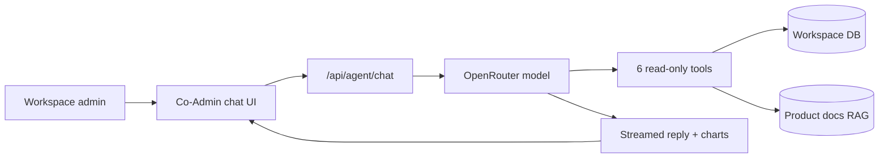

**Vendschat** by **Vendocker LLC**. This document is training material for the native **AI Workspace Co-Admin** (also called **Co-Admin**). It explains what Co-Admin is, who it serves, how it fits the product, and where to find deeper guides in this folder.

---

## What Co-Admin is

Co-Admin is an **internal AI assistant for your team** — workspace owners, admins, and operators. It is **not** a customer-facing bot.

| Aspect | Co-Admin |
|--------|----------|
| **Audience** | Your employees (ops, support leads, agency account managers) |
| **Purpose** | Answer Vendschat product questions and show **live read-only** workspace data |
| **Location in app** | Left navigation → **AI Workspace Co-Admin** (`/co-admin`) |
| **Data scope** | **Current workspace only** — whatever workspace you have selected in the session |
| **Persistence** | Private chat history per user, per workspace |

Customers never talk to Co-Admin. Customers talk to **customer AI Agents** in Chat threads (see [Co-Admin vs customer AI Agents](/co-admin/co-admin-vs-customer-ai-agents)).

---

## Example: New ops hire at VoltRide

**Aisha** joins VoltRide (e-bike retailer) as Operations Coordinator. On day one she opens **AI Workspace Co-Admin** instead of filing engineering tickets.

| She asks… | Co-Admin does… |
|-----------|----------------|
| “What’s connected in this workspace?” | Calls live workspace tools → channel counts, webhook totals, inbox thread summary |
| “How do broadcasts work?” | Searches product docs → explains label campaigns, Chat composer, templates |
| “How many open threads do we have?” | Workspace overview → `inbox.by_status.open` |
| “What’s the difference between AI Agents and Generate Reply?” | Searches `ai-agents/` docs → explains customer bots vs inbox assist |
| “Delivery rate on WhatsApp last 30 days?” | Channel analytics tool → may render a chart |
| “Look up customer jane@example.com” | Contact analytics → threads, labels, support team, message stats |

She returns the next week — her chats are still in the sidebar under **Today** or **Previous 7 days**.

---

## What Co-Admin can do (summary)

1. **Live workspace read** — channels, webhooks, inbox totals, AI agent counts, labels, team size  
2. **WhatsApp analytics** — sent, delivered, read, failed, rates (7–90 day windows)  
3. **Contact lookup** — by **email or phone** (not name alone): conversation stats, labels, assignees, estimated cost  
4. **Product documentation search** — how-to guides across all `co-admin-docs/` categories (channels, inbox, billing, etc.)  
5. **Explain concepts** — AI Agents vs Co-Admin, handover, broadcasts vs templates, multi-workspace agencies  
6. **Visual answers** — line, bar, area, combo, scatter, and pie charts when trends or comparisons help  

Full capability list and hard limits: [Limitations, privacy & FAQ](/co-admin/co-admin-limitations-and-faq).

---

## What Co-Admin cannot do (summary)

- Read or **send** customer inbox message **content**  
- Create, update, or delete channels, webhooks, labels, templates, or automations  
- Build n8n, Zapier, or Make workflows (planned for later phases)  
- Access customer AI Agent **knowledge bases** (`ai_knowledge_*`)  
- See other workspaces or invent metrics — it must call tools for live numbers  

For reading and replying to customers, use **Chat**. For full analytics exports and Meta cost views, use **Analytics**.

---

## How Co-Admin answers questions (architecture)



1. User types in the chat composer on `/co-admin`.  
2. Frontend sends messages + `workspaceId` to the agent chat API.  
3. The model receives a system prompt with **CAN / CANNOT** rules and optional **routing hint** based on the latest user message.  
4. Up to **6 tool steps** per turn may run (overview, channels, webhooks, analytics, contact lookup, doc search).  
5. Tool results return from the backend scoped to the user’s workspace membership.  
6. Large tool payloads may be compressed when Headroom compression is enabled server-side.  
7. Replies stream back; chart sections use structured ` ```chart ` JSON (not Mermaid, not markdown tables labeled as charts).  
8. Messages save to the user’s Co-Admin chat history on the server.

Details: [Navigation & UI](/co-admin/co-admin-navigation-and-ui), [Tools reference](/co-admin/co-admin-tools-reference), [Question routing](/co-admin/co-admin-question-routing).

---

## Where Co-Admin fits vs other Vendschat areas

| User need | Best place | Co-Admin role |
|-----------|------------|---------------|
| Reply to a customer | **Chat** | Explain how; cannot send |
| Train a customer bot | **AI Agents** | Explain setup; cannot edit KB |
| Campaign / broadcast | **Chat** → template composer → Broadcast | Explain workflow via docs |
| Historical trends & CSV export | **Analytics** | WhatsApp metrics via tool; point to Analytics for Meta API views & exports |
| Change plan / seats | **Settings → Billing** | Explain plans via `billing/` docs; cannot change billing |
| Connect WhatsApp | **Settings → Channels** | Step-by-step via `channels/` docs |
| “What’s connected right now?” | **Co-Admin** or Settings | Co-Admin is fastest for a spoken summary |

---

## Documentation corpus Co-Admin searches

When users ask product how-to questions, Co-Admin calls **search_product_docs**, which searches ingested markdown from `co-admin-docs/`:

| Category folder | Topics |
|-----------------|--------|
| `getting-started/` | Welcome, onboarding, first channel |
| `use-cases/` | E-commerce, agency, SaaS, clinics, social commerce |
| `channels/` | WhatsApp, Messenger, Instagram, workspaces |
| `inbox/` | Chat, labels, assignments, composer |
| `ai-agents/` | Customer bots, knowledge, handover |
| `broadcasts/` | Label campaigns |
| `templates/` | WhatsApp templates |
| `integrations/` | Webhooks, HubSpot, API, automation platforms |
| `analytics/` | Dashboard metrics, exports, limitations |
| `billing/` | Plans, usage, pricing |
| `co-admin/` | This folder — Co-Admin itself |

Only documents ingested with `--status ready` are searchable.

---

## Suggested questions by persona

### Operations / support lead

- Give me a workspace overview.  
- How many unread messages across open threads?  
- List active webhooks.  
- Which WhatsApp channels are connected?  
- How do shared inbox labels work?  
- WhatsApp delivery rate last 14 days — show a chart.

### Agency account manager

- How do agencies use multiple workspaces?  
- Difference between Co-Admin and client-facing AI Agents?  
- How do I invite a teammate to one workspace only?  

### New admin (setup)

- How do I connect WhatsApp?  
- How do templates work?  
- What’s on the free plan?  
- How do I set up HubSpot sync?

### Manager (standup)

- Workspace overview at start of meeting.  
- Compare Co-Admin live snapshot with **Analytics** for last week’s campaign performance.

---

## Related guides in this folder

| Document | Use when answering… |
|----------|---------------------|
| [Navigation & UI](/co-admin/co-admin-navigation-and-ui) | Where is Co-Admin, sidebar, history, charts, mobile |
| [Tools reference](/co-admin/co-admin-tools-reference) | Parameters, response fields, example questions per tool |
| [Question routing](/co-admin/co-admin-question-routing) | Live data vs docs vs general; disambiguation |
| [vs customer AI Agents](/co-admin/co-admin-vs-customer-ai-agents) | Bot assignment, handover, Generate Reply |
| [Limitations & FAQ](/co-admin/co-admin-limitations-and-faq) | Cannot-do list, troubleshooting, long Q&A bank |
| [Workspace Co-Admin (quick start)](/co-admin/workspace-co-admin) | Short intro for humans |

---

## Privacy and permissions

- Co-Admin respects **workspace membership**. Tools call `assertUserWorkspaceMember` — users only see data for workspaces they belong to.  
- Co-Admin chat history is **per user** — teammates do not see each other’s Co-Admin conversations.  
- Co-Admin does **not** expose raw inbox message bodies. Contact analytics returns **aggregates** (counts, dates, assignees, labels) and thread metadata.  
- Route `/co-admin` is in **always accessible** routes so members can use Co-Admin even when page access is restricted to Chat only.  
- For PII in analytics questions, prefer work emails or business phone numbers the user already has permission to view.

---

*For a one-page human intro, see [Workspace Co-Admin](/co-admin/workspace-co-admin).*
